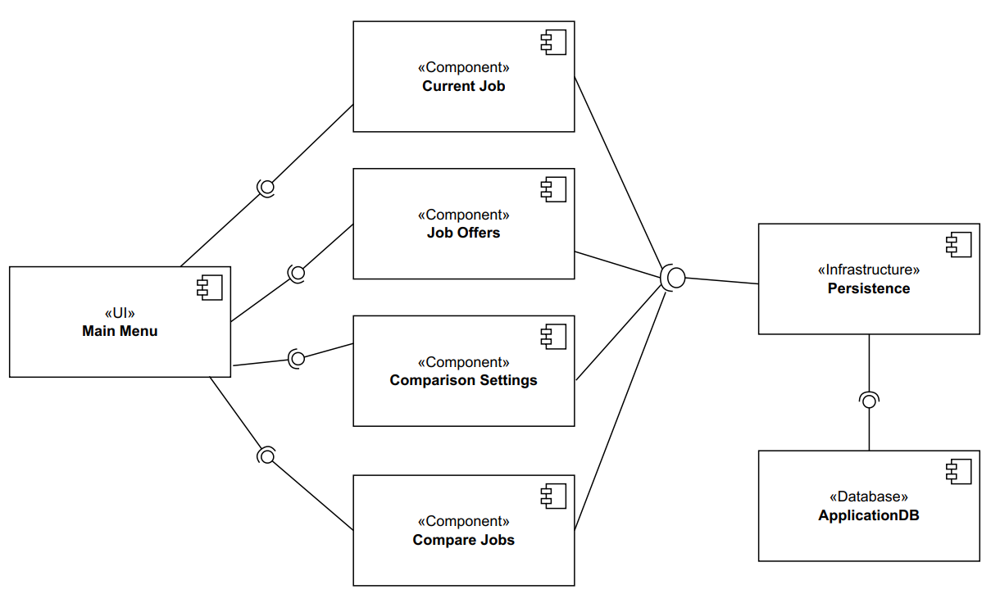
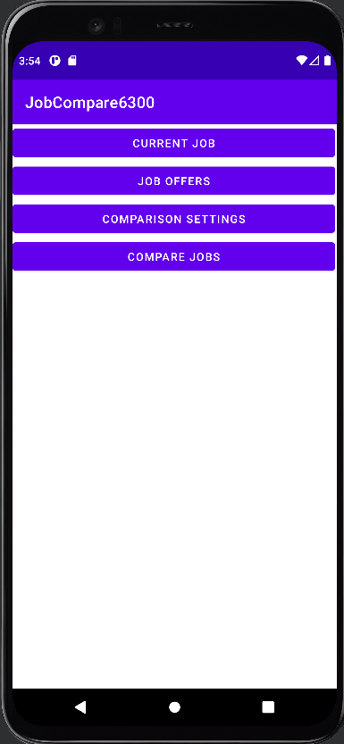

# Design Document

**Author**: team046

## 1 Design Considerations

### 1.1 Assumptions

The first assumption is that all team members can work with java, git, and Android Studio. The software is assumed to run on the device Pixel 4 XL, the minimum SDK is API 30: Android 11.0, java 11 is used to develop the back end methods, Junit is used for testing, SQLite is used to store information of job offers. Our three-member team assumes the development will progress as planed. 

### 1.2 Constraints

This software is developed with Android Studio, it can't be developed with other IDEs. The software will be developed and tested on Pixel 4 XL, its robustness to other devices is not clear. The required minimum SDK is API 30: Android 11.0, it can't work on older devices. 

### 1.3 System Environment

The hardware must have a touch screen with good resolution to accept input. The software requires an Android phone with Android 11 or newer, the default device is Pixel 4 XL. The hardware should have enough disk space to install and run the software.

## 2 Architectural Design

### 2.1 Component Diagram

The diagram shows how the components of the application connect with each other at high level. The main menu interface will guide user to different interfaces: current job, job offers, comparison settings, and compare jobs. The application will use SQLite as database to provide persistence. 

### 2.2 Deployment Diagram

This diagram shows that the application will be deployed on android device with android 11 or newer, the SQLite database can be deployed on the phone or outside device.

## 3 Low-Level Design

### 3.1 Class Diagram

*In the case of an OO design, the internal structure of a software component would typically be expressed as a UML class diagram that represents the static class structure for the component and their relationships.*

This diagram shows the class structure for the component and their relationships within the software.

There are seven main components:
- Main menu: the main interface offers navigation between many interfaces to input information and perform comparison
- Current job: in this interface, the user can input information of current job
- Job offers: the user can input the information of job offers
- Comparison settings: the user can set weights for different attributes
- Compare jobs: the user can see the ranked list of job offers and select two of them to compare
- Persistence infrastructure: keep all data persistent 
- SQLite database: the database to store information of job offers

### 3.2 Other Diagrams

We didn't design any other diagrams.

## 4 User Interface Design

- Main menu
  
    

- Current job

    

- Job offers

    

- Comparison settings

    

- Compare jobs

    

