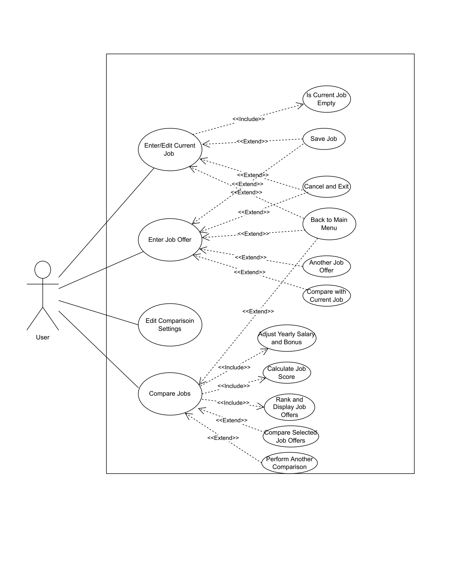

# Use Case Model

**Author**: team046

## 1 Use Case Diagram

## 2 Use Case Descriptions

- Use case: Enter/Edit Current Job
  - Requirements: the user can input the details of current job
  - Pre-conditions: the use click the current job button, if the current job is empty, the user can input, if the current job is not empty, the user can edit the details
  - Post-conditions: the user inputs all required fields, and can decide save, cancel, and back to main menu
  - Scenarios: the user start the app and click the current job icon, then input all required fields, then the user can decide to save or cancel the inputs and back to the main menu
- Use case: Enter Job Offer
  - Requirements: the use can enter the details of job offer, then decide to save, cancel or enter details of another job offer.
  - Pre-conditions: the user click the job offers icon, and input all required fields
  - Post-conditions: the user can decide to save, cancel or enter details of another job offer
  - Scenarios: the user start the app and click job offers icon, then input all required fields, the user can decide to save, cancel, back to main menu, or enter details of another job offer
- Use case: Edit Comparison Settings
  - Requirements: the user can set the weights of yearly salary, yearly bonus, retirement benefits, relocation fee, and training and development fund
  - Pre-conditions: the user click the comparison settings icon, and set integer weight of each attributes
  - Post-conditions: the user can decide to save inputs or exit with the default settings
  - Scenarios: the user start the app and click the comparison settings icon, then input integer weight of each attribute, then decide to save inputs or exit with the default settings

- Use case: Compare Jobs
  - Requirements: the user can see the list of job information, the job is ranked from best to worst by score, the score is calculated by formula AYS + AYB + (RBP * AYS / 100) + RS + TDF. The user can select two job offers and compare them.
  - Pre-conditions: the user click the compare jobs icon and select two job offers
  - Post-conditions: the user can decide to back to the main menu or perform another comparison
  - Scenarios: the user start the app and has inputted details of current job and some job offers, then the user click the compare jobs icon, select two job offers to compare them. The user can decide to perform another comparison or back to main menu.

- Use case: Is Current Job Empty
  - Requirements: check if the current job is empty
  - Pre-conditions: the user click the current job icon
  - Post-conditions: if the current job is empty, the user can input the details of current job, if it's not empty, the user will see the information of current job and can edit the details of it.
  - Scenarios: the user enter the interface of current job, then the information of current job will be displayed if it's empty, otherwise, the user will input all black fields
- Use case: Save Job
  - Requirements: the user can save the input
  - Pre-conditions: all required fields are filled
  - Post-conditions: the information of current job or job offer will be stored in database
  - Scenarios: the user enter the current job or job offers interface and fill all required fields, then click save button, the information will be saved in database

- Use case: Cancel and Exit
  - Requirements: the user can exit the current interface without saving
  - Pre-conditions: the user enter the interface
  - Post-conditions: the inputs will not be saved
  - Scenarios: the user enter the current job or job offers interface, then decide to cancel the inputs and exit without saving

- Use case: Back to Main Menu
  - Requirements: the user can move from other interfaces to the main interface
  - Pre-conditions: the user click the back button
  - Post-conditions: the interface will be transferred to main interface
  - Scenarios: when the user is not in a main interface, the user can click the back button to transfer to the main interface

- Use case: Another Job Offer
  - Requirements: the user can enter information of another job offer
  - Pre-conditions: the user click the another job offer button
  - Post-conditions: the user can input information of another job offer
  - Scenarios: when the user in the job offer interface, he can enter another job offer when he clicks the another job offer button

- Use case: Compare with Current Job
  - Requirements: the user can compare current job offer with current job
  - Pre-conditions: the user has inputted information of current job and job offer
  - Post-conditions: the details of job offer and current job will be displayed
  - Scenarios: on the job offer interface, the user can compare job offer with current job when the user has inputted information of current job and job offer

- Use case: Adjust Yearly Salary and Bonus
  - Requirements: yearly salary and bonus can be adjusted by cost of living
  - Pre-conditions: the information of yearly salary, yearly bonus, and cost of living have been inputted
  - Post-conditions: yearly salary and bonus are adjusted by cost of living
  - Scenarios: when the user input the information of yearly salary, yearly bonus, and cost of living, the adjusted yearly salary and bonus are calculated

- Use case: Calculate Job Score
  - Requirements: each job offer needs a score to be sorted, the formula to calculate the score is AYS + AYB + (RBP * AYS / 100) + RS + TDF
  - Pre-conditions: all required information of job offers have been filled
  - Post-conditions: each job offer will be assigned an attribute score
  - Scenarios: when the user has filled all required fields of job offer, the score of each job offer will be calculated to rank the job offers

- Use case: Rank and Display Job Offers
  - Requirements: the job offers will be displayed from best to worst by score
  - Pre-conditions: the score of each job offer has been calculated
  - Post-conditions: the jobs will be displayed from best to worst by score
  - Scenarios: when the user on the compare jobs interface, the job offers in the database will be displayed on the screen from best to worst by score

- Use case: Compare Selected Job Offers
  - Requirements: the user can select two job offers from the list
  - Pre-conditions: the job offers are displayed on the interface, the user can select two job offers by clicking
  - Post-conditions: the details of the selected job offers will be displayed on the interface
  - Scenarios: the user can select two job offers from the list, then the details of the selected job offers will be displayed on the interface

- Use case: Perform Another Comparison
  - Requirements: the user can perform another comparison when the current comparison is displayed
  - Pre-conditions: the current comparison is displayed and the user click the perform another comparison button
  - Post-conditions: the user can repeat the process in Compare Selected Job Offers
  - Scenarios: when the user finish the current comparison, he can perform another comparison, repeat the process in Compare Selected Job Offers