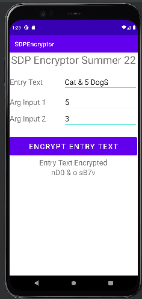

# CS 6300: Software Development Process

Course website: (https://omscs.gatech.edu/cs-6300-software-development-process)

- [CS 6300: Software Development Process](#cs-6300-software-development-process)
  - [Group Project](#group-project)
  - [Individual Project](#individual-project)
  - [Homeworks](#homeworks)
    - [Homework 1](#homework-1)
    - [Homework 2](#homework-2)
    - [Homework 3](#homework-3)
    - [Homework 4](#homework-4)
    - [Homework 5](#homework-5)
    - [Homework 6](#homework-6)

## Group Project

Built an Android APP to compare job offers with benefits, in different locations, and other aspects
beyond salary. Firstly, create a design in UML. Secondly, implement the APP with Android Studio.

## Individual Project
-

## Homeworks

### Homework 1

  Team match survey.

### Homework 2

  Git usage.
  
### Homework 3

Basic Java coding and JUnit. Intellij IDE was used.

### Homework 4

  Developed a simple Android app, SDPEncryptor, that encrypts messages using a simple substitution cipher. Android Studio was used.
  
  

### Homework 5 

  Built UML design and description documents for an Android APP to compare job offers.

### Homework 6

  White-box testing.

