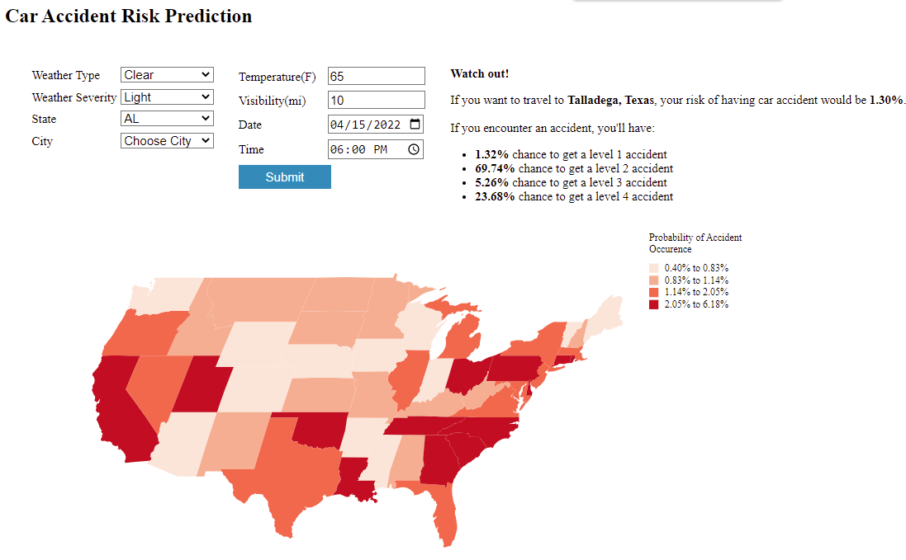

# Group Project

A comprehensive study of US traffic accident evaluation and prediction.

The requirement of the final project is [here](https://docs.google.com/document/d/e/2PACX-1vQIxe_jGt4p_7zQIXxLLNKQfJ-vh1D-13V9UQlHUWC46lgHSi1rDjEiYGQZrOVK_0LCzfZsJTWw-KZh/pub).

The final project includes:
## 1. [Final report](https://github.com/ycheng22/OMSCS_Courses/blob/main/CSE%206242%20Data%20and%20Visual%20Analytics/Group%20Project/Final%20Report.pdf)
## 2. [Poster](https://github.com/ycheng22/OMSCS_Courses/blob/main/CSE%206242%20Data%20and%20Visual%20Analytics/Group%20Project/Poster.pdf)

## 3. Website: https://dva-team145-traffic.herokuapp.com/

