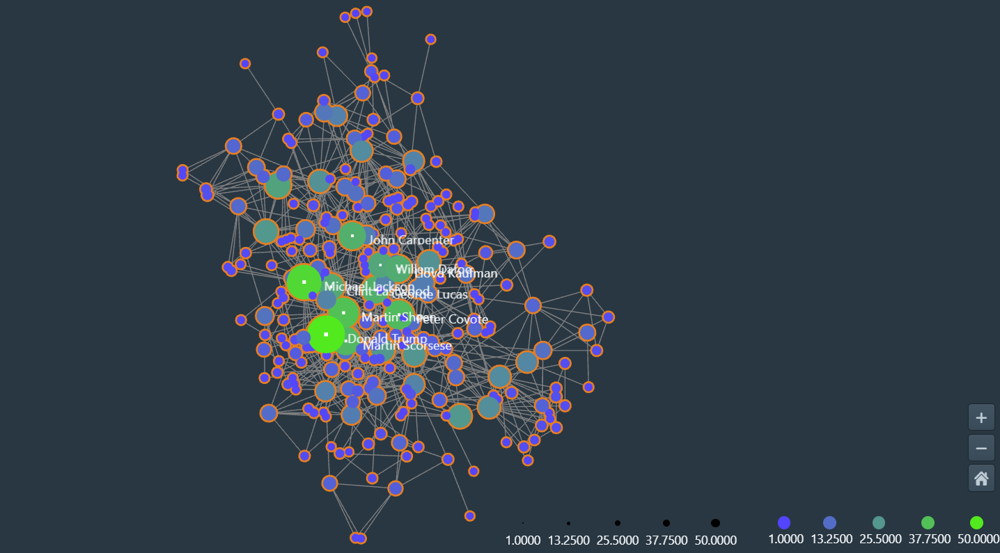

# CSE 6242: Data and Visual Analytics

Course website: (https://poloclub.github.io/cse6242-2022spring-online/)

## Group Project

abc

## Homeworks

- Homework 1
  - Q1: Collecting data from TMDb and visualizing co-actor network using Argo Lite
  
  - Q2: SQLite operations
  - Q3: D3js warmup
  - Q4: OpenRefine
  - Q5: Introduction to Python Flask
  
- Homework 2 (D3js)
  - Q1: Visualizing data with Tableau
    

        
        
    

  - Q2: Force-directed graph layout
    
  - Q3: Line Charts
  - Q4: Interactive Visualization
  - Q5: Choropleth Map of Board Game Ratings
    

- Homework 3
  - Q1: Analyzing trips data with PySpark
  - Q2: Analyzing dataset with Spark/Scala on Databricks
  - Q3: Analyzing Large Amount of Data with PySpark on AWS
  - Q4: Analyzing a Large Dataset using Spark on GCP
  - Q5: Regression: Automobile price prediction, using Microsoft
Machine Learning Studio
  

- Homework 4
  - Q1:
  - Q2:
  - Q3:
  - Q4:
  - Q5
  

